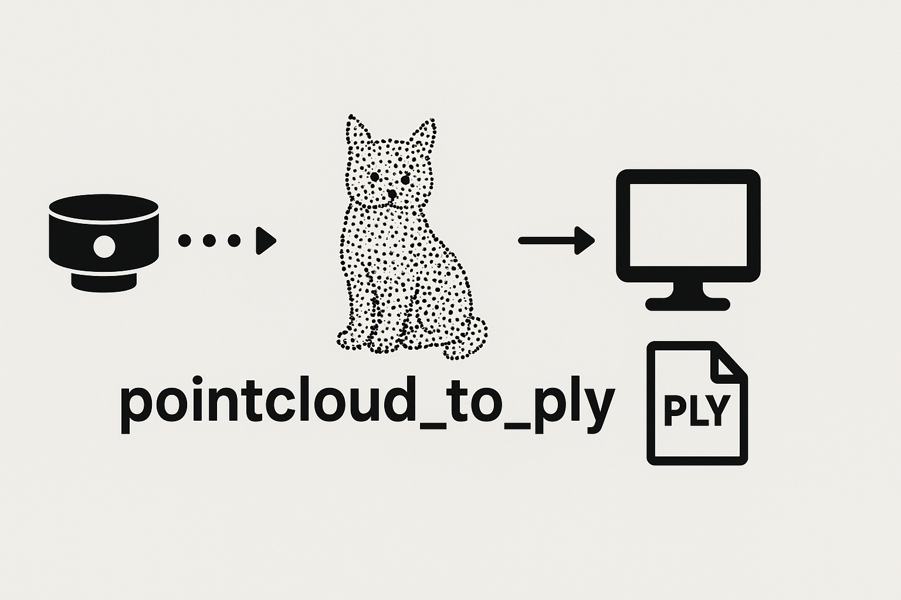

<h1 align='center' style="text-align:center; font-weight:bold; font-size:2.0em;letter-spacing:2.0px;"> pointcloud_to_ply </h1>

<p align="center">
  
</p>

<p align="center">
  <a href="https://build.ros2.org/job/Jdev__pointcloud_to_ply__ubuntu_noble_amd64/"></a>
  <a href="LICENSE"></a>
</p>

The `pointcloud_to_ply` package is intended to capture a point cloud from a sensor by subscribing to the topic where it publishes messages to, and store it in `.ply` or `.obj` format on disk.

### Parameters

Set your specific point cloud sensor topic, save location, and other params in

```bash
launch/pointcloud_to_ply.launch.xml
```

### Launch

```bash
ros2 launch pointcloud_to_ply pointcloud_to_ply.launch.xml
```
